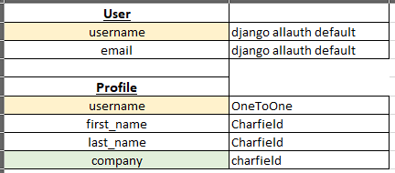

# ReynoldsMachinery

## Index
* [Introduction](#Introduction)
* [Planning](#planning)
*

## Introduction

__Live Site__  - _To be added_

__Repo Site__ - _To be added_

This project is created to meet the criteria to display my learning abilities of project 4 of 5 to CodeInstite's level 5 diploma for full-stack developer.

With use of Python language and Django framework, I will be creating an application to aid my current role. With management of over 500 fleet machines - minute management of all machines on a large project is a hard task to complete - with weekly sending of tracking documents on Microsoft Excel documents, filtering information from the system, e-mails and confirming with contacts.

My intention of this website is for large projects or customers to log onto the website with ability to keep log of hired and their own machines provided by our company.

*With intention for expansion at a later date, this can be used for other company types of machines and/or welders information.*

With a large depth of information on process and requirements, I have used my experience to draw a template of information required and expected layout on how to present the information with an easy-to-view display.

## Planning

On start up of the project, I created a template to help define the basic views, detail requirements and expected behaviours. With this, I modelled each action/behaviour into a user story.

As a User, I wish to:
- Create an Account with my details
- Create a company
- Add other colleagues to my company
- Create labels for my 3 fields of the table view
- Add a machine to our records
- Create a job to include a machine my page
- Edit details on the job page, including contact, location and notes.
- Add comments to jobs with identification on who wrote the comment
- Edit comments to change their status on open/in progress/ complete.
- Delete comments made which I feel are no longer relevant.
- Close jobs off to remove from my view.
- View machine information on a seperate page, to include all characteristics available

After many mock drawings of tables, I have decided to use the following paths for my relational tables:

Arrows used on this display is to help guide the relations between each table. i.e username between user and Profile is a one to one relationship, but the username from Profile is able and linked to creation of Company and active job.

Listing all tables, I can identify what type of fields are required. My findings are:

| Profile | Field type |
|----|----|
| username | OneToOne, User |
| first_name | CharField, max_length=25|
| last_name | CharField, max_length=40 | 
| company | CharField, max_length=50 |

| Company | Field type |
|---|---|
| company_name | primary_key blank=False unique=True|
| members | CharField | 
| site_addresses | CharField |
| phone_number | PossitiveIntegerField |
| field_a | CharField, max_length=25, default="available"| 
| field_b | CharField, max_length=25, default="in use"| 
| field_c | CharField, max_length=25, default="in repair"|

|Job| Field Type|
|---|---|
|machine_id | ForeignKey to="machine_profile/id", blank=False|
| created_by | ForeignKey to="profile/username", blank=False |
| start_date | DateAutoField |
| end_date | DateField, blank=True |
| machine_status | ChoiceField, Field A/B/C |
| location | CharField, Choice from company sites|
| changed_by | CharField (error on picture) |
| changed_on | DateAutoField |
| company_name | ForeignKey to="profile/company/company_name", blank=False|
| Amendment | Job does not require field a b or c as this is on the template |

