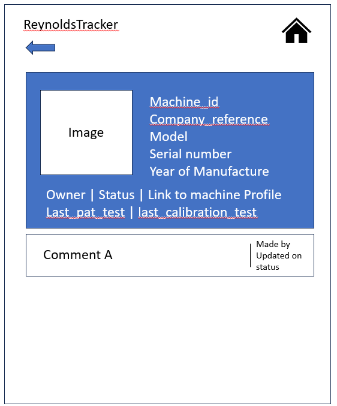

# ReynoldsMachinery

## Index
* [Introduction](#Introduction)
* [Planning](#planning)
* [Design](#design)
* [User Stories & Testing](#testing-and-user-stories)

## Introduction

__Live Site__  - _To be added_

__Repo Site__ - _To be added_

This project is created to meet the criteria to display my learning abilities of project 4 of 5 to CodeInstite's level 5 diploma for full-stack developer.

With use of Python language and Django framework, I will be creating an application to aid my current role. With management of over 500 fleet machines - minute management of all machines on a large project is a hard task to complete - with weekly sending of tracking documents on Microsoft Excel documents, filtering information from the system, e-mails and confirming with contacts.

My intention of this website is for large projects or customers to log onto the website with ability to keep log of hired and their own machines provided by our company.

*With intention for expansion at a later date, this can be used for other company types of machines and/or welders information.*

With a large depth of information on process and requirements, I have used my experience to draw a template of information required and expected layout on how to present the information with an easy-to-view display.

## Planning

On start up of the project, I created a template to help define the basic views, detail requirements and expected behaviours. With this, I modelled each action/behaviour into a user story.

As a User, I wish to:
- Create an Account with my details
- Create a company
- Add other colleagues to my company
- Create labels for my 3 fields of the table view
- Add a machine to our records
- Create a job to include a machine my page
- Edit details on the job page, including contact, location and notes.
- Add comments to jobs with identification on who wrote the comment
- Edit comments to change their status on open/in progress/ complete.
- Delete comments made which I feel are no longer relevant.
- Close jobs off to remove from my view.
- View machine information on a seperate page, to include all characteristics available

After many mock drawings of tables, I have decided to use the following paths for my relational tables:

Arrows used on this display is to help guide the relations between each table. i.e username between user and Profile is a one to one relationship, but the username from Profile is able and linked to creation of Company and active job.

Listing all tables, I can identify what type of fields are required. My findings are:

| Profile | Field type |
|----|----|
| username | OneToOne, User |
| first_name | CharField, max_length=25|
| last_name | CharField, max_length=40 | 
| company | CharField, max_length=50 |

| Company | Field type |
|---|---|
| company_name | primary_key blank=False unique=True|
| members | CharField | 
| site_addresses | CharField |
| phone_number | PossitiveIntegerField |
| field_a | CharField, max_length=25, default="available"| 
| field_b | CharField, max_length=25, default="in use"| 
| field_c | CharField, max_length=25, default="in repair"|

|Job| Field Type|
|---|---|
|machine_id | ForeignKey to="machine_profile/id", blank=False|
| created_by | ForeignKey to="profile/username", blank=False |
| start_date | DateAutoField |
| end_date | DateField, blank=True |
| machine_status | ChoiceField, Field A/B/C |
| location | CharField, Choice from company sites|
| changed_by | CharField (error on picture) |
| changed_on | DateAutoField |
| company_name | ForeignKey to="profile/company/company_name", blank=False|
| Amendment | Job does not require field a b or c as this is on the template |

| Machine Profile | Field Type |
|----|----|
| manufacturer_reference | primary_key |
| company_reference | CharField |
| model | CharField, Choice |
| serial_number | CharField, unique=True |
| year_of_manufacture | DateField |
| status | CharField, Choice |
| owner | CharField, Choice |
| is_electrical | Boolean |
| last_pat_test | DateField |
| last_calibration | DateField |

| Machine Model | Field Type | 
|---|----|
| manufacturer | CharField |
| model | primary_key |
| fusion_type | CharField |
| voltage | CharField |
| image | ImageField |
| manufacturer_product_code | CharField| 

## Design

Previous attempt at creating a tracker for machines on projects were produced in a list format with a status at the final column, but only produced on Microsoft Excel.

Following the design of a KanBan board, my approach is adopting three tables to host status of each machine. With each machine consuming a tile, which can be moved between columns within a form.

For mobile view, these will be visible via accordian display, whilst tablets and larger screens will show three columns side by side.

For mobile view, I have created the following templates:

**Home Page | Tracking Page | Asset Profile | Model Profile**

|  | 
 | 
 |

For larger displays, I have selected the following designs:

**Home Page | Tracking Page | Asset Profile | Model Profile**

|  |
 |
|

each page includes a similar design with a minalistic display but effective show of relevant information.

For an improved user experience, users can opt to create or edit their selected company from the home page. As this icon is to expand within two optional selections, create or edit - clicking of this button/link will open a modal with either option side.

At present, I have only created the create company at present. As users can update their own company names in profile, I encoutered the issue of users are able to add companies to their profile without a verification method. To counter this, I've included an additional "pin" requirement to the company profile, which will be used in the edit profile. This will include if company in list of companies and pin is equal to the created, update the form. Otherwise an error will be displayed.

## Testing and User Stories

Upon modular completion, and completion of the user stories on my project/kanban board of github, I am conducting a series of test to ensure the installments are behaving as expected. Below tables display my behaviour driven testing applied to the uploads:

1. As a user I wish to create an account:
    * On the website's landing page, you are met with two prompts to either log in or create an account. On clicking signup, you will be transfered to a signup page imported by django allauth (yet to be edited).
    * Completing the form and submitting will transfer the user back to the home page. Navigation bar will display option to signout rather than login or signup.
        * 
1. As a user I wish to log into my account with display confirmation:
    * Whilst logged out, visiting the applications homepage, select icon to login.
    * Enter the account details used to create your account earlier.
    * At present, on login, the page is redirected to homepage with navbar confirming the user is logged in. Recent amendment allowes inclusion of username login in the header as a form of confirmation:
        * 
1. As a user I wish to log out of my account with confirmation of no longer being logged in.
    * After logging in, visiting the navbar icons to request a logout of my account.
    * Confirm request to log out with page provided by django allauth.
    * Once complete, the user will be navigated back to the front page with all links advising to log in or signup.
        * 
1. As a user I wish to create a company.
    * Once a user is logged in, the home/landing page will include a list of options availalbe for the user.
    * Second link, advises of Company Details. Clicking on this will display a modal of two further options, create or edit.
    * Selecting Create will then forward the user to a form page for creation of an account.
        * 
        * 
        * 
        * 
1. As a user I wish to join a company.
    * Similar to steps above, once logged in and loaded the landing page you will be prompted with buttons for links.
    * Second link, advises of Company Details. Clicking this will bring up two options, Create or Join (Different from above as edited for better user experience)
    * Clicking Join Company you will be re-directed to a page with a two field form.
        * 
    * In attempt to join a company, you will receive feedback depending if an error occurs or success:
        * Incorrect Company, typing in a company which does not exist on the database will return "Company does not exist" under the form:
        * 
        * Incorrect Pin, typing an incorrect pin for the company will return "Pin entry is incorrect":
        * 
        * Fields with no entry, crispy forms will display both fields require entry:
        * 
        * 
    * When successful, you will be redirected to the homepage with a confirmation at the top of the page advising you have joined the company:
        * 
1. As a user I wish to edit my company details.
    * Copying the above steps, on log in of the website the main landing page will advise me of links available.
    * If a user is registered to a company, clicking on the second option of Company details they will be displayed with Edit or Leave.
    * Clicking on Edit compnay, the user is forward to a form page similar to create company pre-populated with fields already entered:
        *  
    * After either editing or updating a field, the user can scroll to the bottom of the form to view two buttons - update or cancel.
        * Selecting Update will display save the data entered, directing the user to the front page and display a message to confirm the company has been updated:
            * Error found - as a PositiveIntegerField, this field will not allow a number to be entered.
            * 
            * Extending django's library with django-phone-field allowed me to edit this field and run another migration to display a correct field:
            * 
        * Selecting cancel will re-direct the user to the front page with no changes being made- confirmed as working correct
1. As a user I wish to leave the current company.
    * On login, the user will be displayed with a list of buttons and descriptions on their purpose.
    * Selecting the second option - Company Details will display a modal box of two links - update or leave.
    * Pressing leave will redirect the user to the front page with confirmation above the links to confirm they have left the company.
    * 
    * Note: Grammar error found with additional '. this was removed after saving the above screenshot.
1. As a user I wish to create a new model
    * Users have the ability to load their own asset information as they may use this for other supplier machines on the same site.
    * A further update results in another button on the landing page leading to a pop up modal. Options when selecting "New Machine details" lead to either New Model or New Asset.
    * When clicking on new Model, a new userform will be presented requesting for relevant information and requirement fields.
    * 
    * I have opted to allow this as a create only. Updates will need to be made via admin/staff at the admin panel.
1. As a user I wish to create a new Asset.
    * Users have the ability to load their own asset information as they may use this for other supplier machines on the same site.
    * A further update results in another button on the landing page leading to a pop up modal. Options when selecting "New Machine details" lead to either New Model or New Asset.
    * Clicking new asset will load the user to a new form for creation of a new asset.
    * Completing the form, provided allows the user to create the asset - with a confirmation displayed on the front page. User is re-directed to the home page on completion.
    * Edit - on testing the form required a date format rather than a year field. Now edited with dropdown list from year 1980 onwards.
    * Error - code is requiring model reference to be a MachineModel reference, but logged as string. **To be Fixed**
1. As a user I wish to view all jobs in one screen.
    * If a user is assigned a company, they are provided with an option at the top of the list - referenced as a tracking page.
    * On clicking the tracking button, the user is re-directed to a page with all jobs listed.
    * The view is altered if the customer is viewing with a mobile or larger screens.
    * Mobile view: 
        * 
    * Larger screen view:
        * 
1. As a user, I wish to view job details on a page.
    * On login, the customer can navigate to the tracking page (providing they are within a company).
    * Each tile/card displayed will navigate the user to the job detial page on click.
    * This will display information of the machines with options for edit and delete below:
        * 

